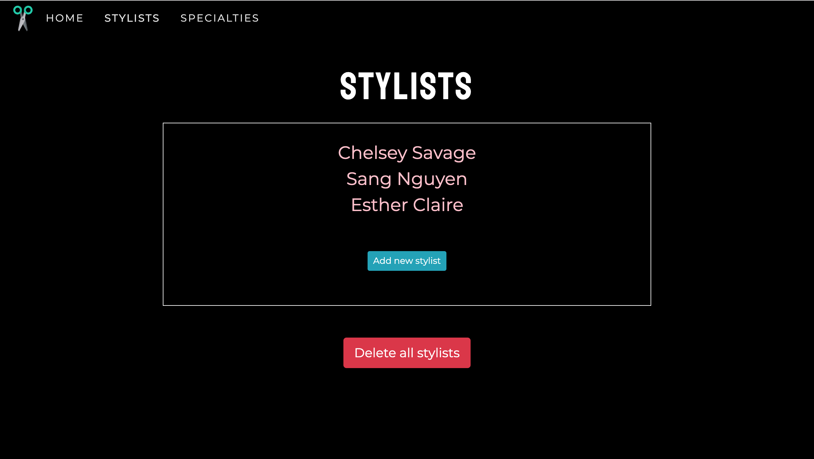
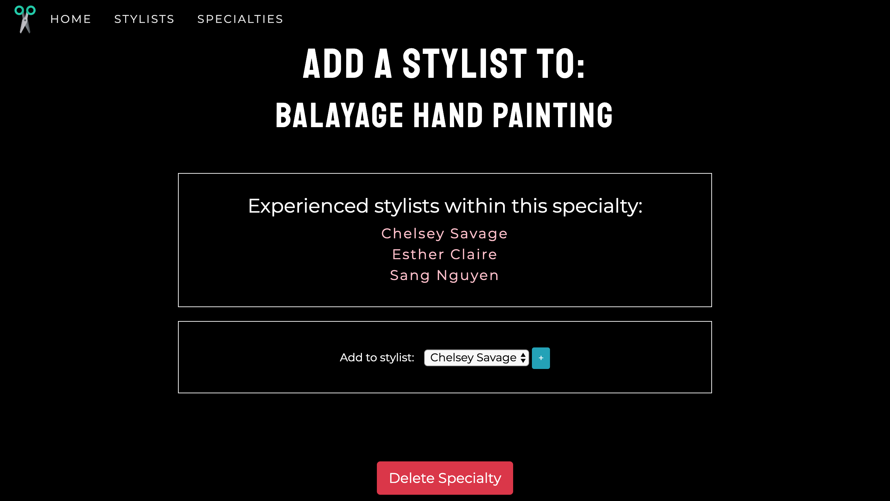

# Hair Salon

#### _C#, Week 3 Independent Project, *05.10.2019*_

#### By _Ashley J. Ancheta_

## Description
This is an application for Hair Salon employers to keep track of their stylist and their clients. They are able to add, edit and delete new stylists and clients.

## Preview




## Specs
| Behavior | Input | Output |
| ------------- |:-------------:| -----:|
| "View" links will redirect the user to a list of inputted information | Click "View Stylists" | Redirects to a cshtml page to view all stylists |
| "Add" buttons will redirect the user to a form where they can add a stylist or client | Click "Add" | User will be redirected to a form cshtml page |
| All forms will input that data to database | User inputs in a stylist name "Chelsey Savage" | Added to database |
| "Delete" buttons will remove the selected stylist or client from the database | User selects a stylist name "Chelsey Savage" and hits the delete button | "Chelsey Savage" is now deleted on database |
| "Edit" buttons will edit the selected stylist or client from the database | User inputs "Chelsey Savege" with spelling error. User will edit to "Chelsey Savage" | "Chelsey Savege" is now edited to "Chelsey Savage" in the database |

## Installation Requirements
* Download and install .NET Core SDK 2.2.203.
* Download and install MAMP 5.7.25 for your personal operating system (Mac/Windows).
* Download and install the latest Mono Release (5.20.1.19).

## Setup Instructions for accessing the Application
* Clone this repository "https://github.com/ajancheta/HairSalon.Solution.git"
* Open the repository in a preferred text editor such as Atom or Visual Studio Code.

To run the application, open your machine's terminal and navigate to the top project directory `HairSalon`. Type in the following commands:

```sh
$ dotnet restore
$ dotnet build
$ dotnet watch run
```

Finally in your browser type in url http://localhost:5000/


## Setup Instructions for accessing the Database
For Mac: In your terminal type in:
```sh
$ /Applications/MAMP/Library/bin/mysql --
```

For Windows: In your terminal type in:
```sh
$ C:\MAMP\bin\mysql --host=localhost -uroot -proot
```

* In the MAMP pop-up, select "Open WebStart Page." This action should prompt you to an html page. Select "Tools" from the navigation bar, then select "PHPMyAdmin".
* This action will redirect you to the server databases. You will need to have cloned down the HairSalon.Solution application from GitHub to complete the following steps. To access the HairSalon database that was created for this project, select "Import" in the navigation menu and navigate to the file "aj_ancheta.sql" within the HairSalon.Solution's files.
* Select "Go" and the database should now be accessible. Repeat the importing steps to import the test database as well.

## Setup Instructions for re-creating the Database
After successful installation of MAMP and MySQL, connect to the server by running $ mysql -uroot -proot in the command line. If this gives you an error, instead, refer to the top setup instructions for using file paths based on your personal operating system (Mac/Windows).

To create a database complete the following commands:

```sh
> CREATE DATABASE aj_ancheta;
> USE aj_ancheta;
> CREATE TABLE stylists (id PRIMARY KEY, name VARCHAR(255));
> INSERT INTO stylists (id, name) VALUES (1, "Chelsey Savage"), (2, "Channey Tang Ho");
> CREATE TABLE clients (id PRIMARY KEY, stylist_id INT);
> INSERT INTO clients (id, stylist_id, name, phone) VALUES (1, "Chelsey Savage", 5032334444), (2, "Channey Tang Ho", 5031112222);

For each id in each table: assign the id's to become the primary key.
```

## Known Bugs
There are no known bugs.

## Support and contact details
This application is best viewed on a full screen. Should any problems occur, discover other bugs, or experience issues with viewing, please contact me at ashleyjancheta@gmail.com

## Technologies Used
This application was built in Atom using C#, .NET Core SDK 2.2.203, Git, MAMP 5.7.25, and Mono (5.20.1.19).

### License

*This software is licensed under MIT license.*

Copyright (c) 2019 **_Ashley J. Ancheta_**
